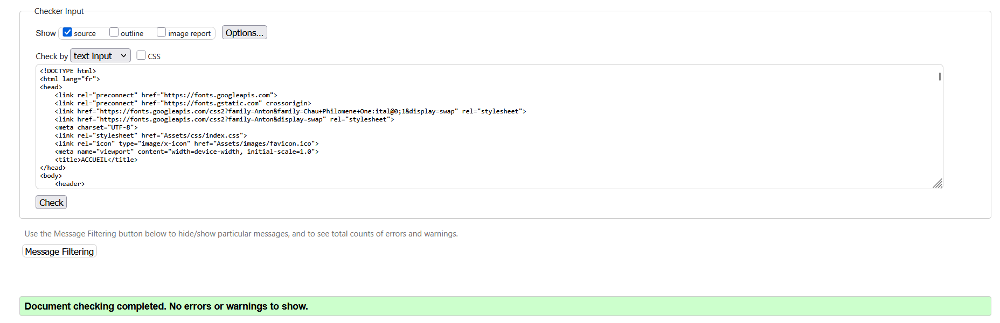
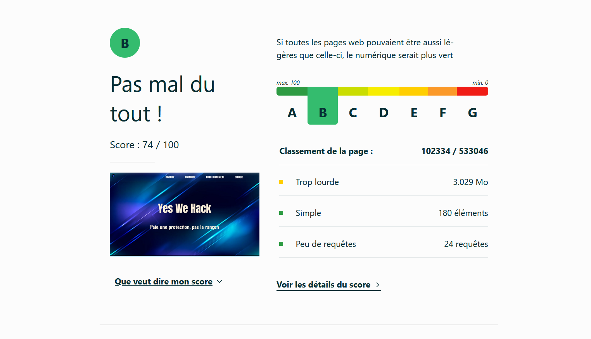
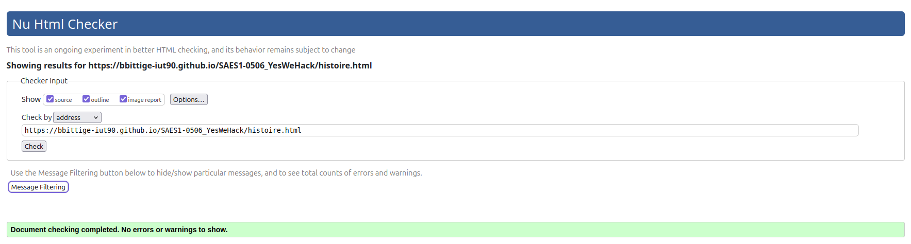
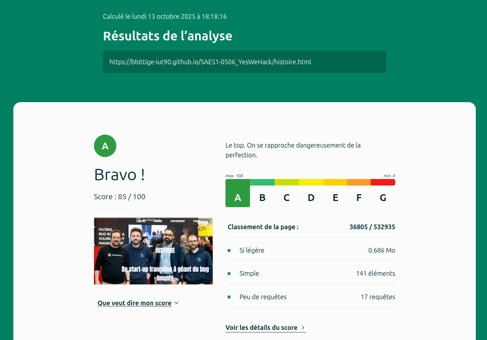
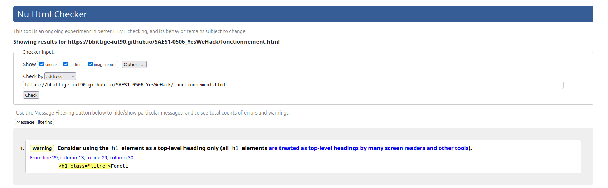
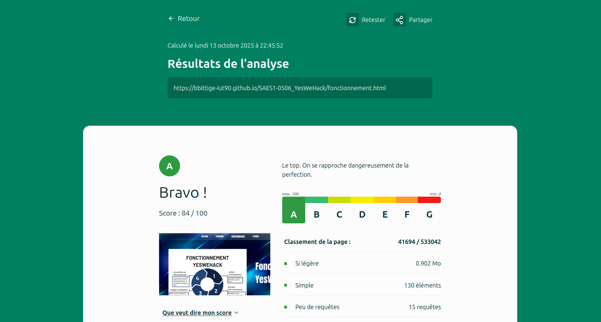
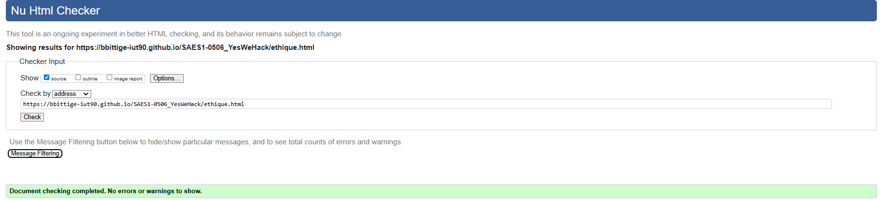
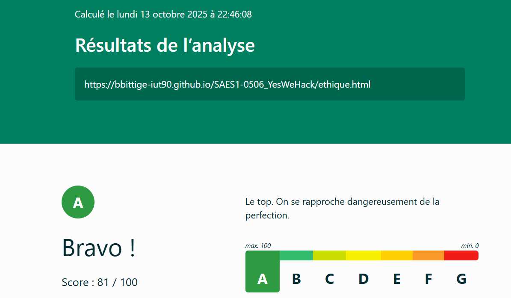
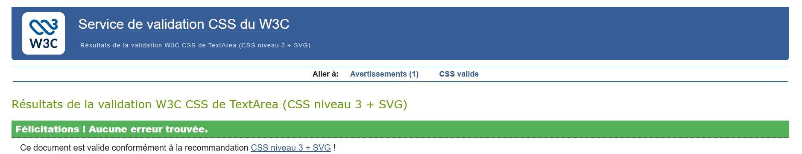
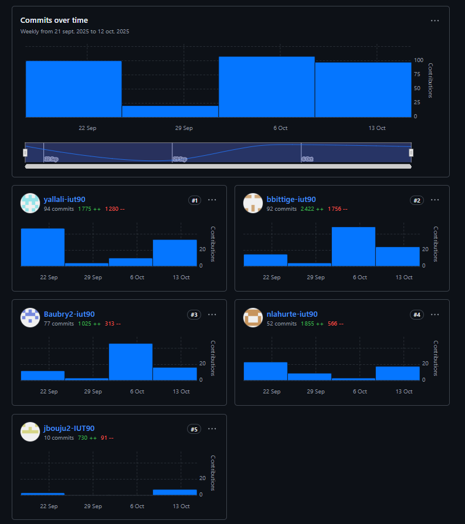

# YesWeHack
## Sujet
page github: [cliquez ici](https://bbittige-iut90.github.io/SAES1-0506_YesWeHack/)

## Membres du groupe
Etudiant 1 (référent du groupe) : [AUBRY Baptiste](mailto:batiste.aubry@edu.univ-fcomte.fr?subject=SAE_1_05_06)

Etudiant 2 : [BITTIGER Bryan](mailto:bryan.bittiger@edu.univ-fcomte.fr?subject=SAE_1_05_06)

Etudiant 3 : [BOUJU Jarod](mailto:jarod.bouju@edu.univ-fcomte.fr?subject=SAE_1_05_06)

Etudiant 4 :  [ALLALI yanis](mailto:yanis.allali@edu.univ-fcomte.fr?subject=SAE_1_05_06)

Etudiant 5 : [LAHURTE Noé](mailto:noe.lahurte@edu.univ-fcomte.fr?subject=SAE_1_05_06)

## Présentation du projet

Ce dépôt correspond à un site web créé en HTML/CSS dans le cadre de la SAÉ 05-06 à l'IUT NFC. Notre site présentera l'entreprise YesWeHack et retracera **son parcours depuis 2015** jusqu'à sa position actuelle de leader européen en matière de cybersécurité. Il le mettra en avant comme une **solution économique** bénéfique grâce au programme de récompense pour les bugs. Il montrera **le fonctionnement** de l'entreprise et soulignera **l'éthique** des hackeurs responsables.

## Choix de conception du site
Pour la conception du site, nous nous sommes grandement inspirés du site officiel de YesWeHack (disponible [ici](https://www.yeswehack.com/fr))

## Développement du Site Web et Validation des pages
### Page d'accueil
**Auteur: LAHURTE Noé**

Vérification W3C: [détails](https://validator.w3.org/nu/?doc=https%3A%2F%2Fbbittige-iut90.github.io%2FSAES1-0506_YesWeHack%2F)

### Page histoire
**Auteur: BITTIGER Bryan**

Vérification W3C: [Détail ICI](https://validator.w3.org/nu/?showsource=yes&showoutline=yes&showimagereport=yes&doc=https%3A%2F%2Fbbittige-iut90.github.io%2FSAES1-0506_YesWeHack%2Fhistoire.html)

### Page économie
**Auteur:  BOUJU Jarod**

Vérification W3C: 

### Page fonctionnement
**Auteur: AUBRY Baptiste**

Vérification W3C: [détails](https://validator.w3.org/nu/?showsource=yes&doc=https%3A%2F%2Fbbittige-iut90.github.io%2FSAES1-0506_YesWeHack%2Ffonctionnement.html)

Vérification site écologique: [détails](https://www.ecoindex.fr/resultat/?id=dff620c1-dc9c-4a3b-9cbf-c5f7baa74f0d)

### Page éthque
**Auteur: ALLALI Yanis**

Vérification W3C: 

## Répartition du travail
### Planification - Diagramme de GANTT
- BITTIGER Bryan
- AUBRY Baptiste

### Chercher des informations sur le site
- LAHURTE Noé
- BITTIGER Bryan
- BOUJU Jarod
- AUBRY Baptiste
- ALLALI Yanis

### Développement du site
- LAHURTE Noé
  - Page d'accueil
  - Navbar / Footer
- BITTIGER Bryan
  - Page histoire
- BOUJU Jarod
  - Page économie
- AUBRY Baptiste
  - Page fonctionnement
- ALLALI Yanis
  - Page éthique

## Contributeurs

